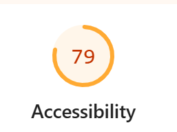
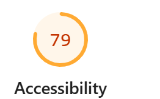
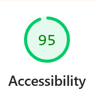

# Q1: Quels sont les arguments que vous pouvez utiliser pour convaincre votre Client de rendre son quizz accessible ? (Vous pouvez vous aider du cour)
Réponse: Les arguments possibles seraient :

Argument éthique et social :
Toutes les personnes, y compris celles en situation de handicap, devraient pouvoir participer dans des conditions équitables.

- légal :
La loi et ne pas la respecter peut entraîner des sanctions ou une obligation de mise en conformité.

- économique :
Un quizz accessible touche un public plus large et améliore l’image de marque

- qualité :
Un site accessible est généralement mieux structuré, plus performant et plus facile à maintenir
# Q2: Ajouter le screen de votre score :
Screen:

# Q3: Est-ce que l'analyse de Lighthouse est suffisante pour évaluer l'Accessibilité de votre Application ?
Réponse:
Lighthouse ne permet pas de tester réellement l’utilisation avec un lecteur d’écran, de vérifier correctement la navigation au clavier, ni d’évaluer la compréhension des contenus et la clarté des consignes ou des formulaires.

# Q4: Combien de fois vous devez utiliser une touche du clavier pour passer le quizz ?
Réponse: 27 clicks ! En utilisant Tab et entrer.

# Q5: Donner 3 roles ARIA et 3 propriété ARIA
Réponse:
Les rôles ARIA permettent de définir la fonction d’un élément, par exemple button, navigation ou alert.

Les propriétés ARIA permettent de donner des informations supplémentaires sur un élément, comme aria-label, aria-hidden ou aria-expanded.

# Q6: Ajouter le screen de votre score Lighthouse
Screen: 

# Q7: L'une des best practice de l'ARIA est "ne pas utiliser l'ARIA" pouvez nous expliquer pourquoi d'après vous ?
Réponse:
La règle « ne pas utiliser l’ARIA » signifie qu’il vaut mieux utiliser d’abord du HTML sémantique natif et tester le site comme un utilisateur en situation de handicap (au clavier, lecteur d’écran, etc.), car un mauvais usage d’ARIA peut rendre l’application moins accessible au lieu de l’améliorer.

# Q8: Ajouter le screen de votre score Lighthouse
Screen:

# Q9: Pourquoi le score de lighthouse n'a pas augmenté d'après vous ?
Réponse:
Le score n’a pas augmenté (toujours 79) car Lighthouse ne mesure pas tous les aspects de l’accessibilité.

# Q10: Quel est la valeur du rapport de contraste actuel :
Réponse: 1.69

# Q11: Quel est la valeur du score AA :
Réponse: 3.0

# Q12: Quel est la valeur du score AAA :
Réponse: 4.5

# Q13: Comment pouvez vous changer la valeur du contraste de votre texte ?
Réponse: On peut modifier la couleur du texte, le backgroung, l'épaisseur et la taille du texte

# Q14: Ajouter le screen de votre score Lighthouse
Screen:

# Q15: Êtes vous capable de déterminer visuellement ce qui est un lien ou pas en appliquant chaque altérations ?
Réponse: Il est assez compliqué de voir les liens, le plus dur étant en vision floue.

# Q16: Ajouter le screen de votre score Lighthouse
Screen:

J'ai eu une erreur au lancement de lighthouse, la page ne charge pas correctement mais j'obtiens toujours cette note.

# Q17:  Proposition 1
Description: Mettre le focus directement sur la première question à l’ouverture du quizz
Nb d'actions gagnée : Beaucoup trop

# Q18:  Proposition 2
Description: Ajouter un conteneur aria-live="assertive" pour annoncer automatiquement chaque question lorsqu’elle apparaît, et également pour annoncer le score final à la fin du quizz. 
Nb d'actions gagnée : Dépends de comment l'utilisateur se déplaçait avant, mais le gain est sans doutes

# Q19:  Proposition 3
Description: Ajouter des raccourcis clavier (ex. 1,2,3,4) pour sélectionner une proposition de réponse directement sans avoir à tabuler jusqu’au bouton correspondant.
Nb d'actions gagnée : entre 0-4 par n*questions
